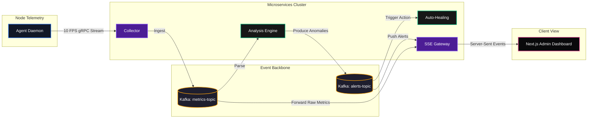

# Realtime Incident Monitoring & Auto-Healing Platform (SRE System)

A production-grade, event-driven microservices architecture built with Go, gRPC, Protobuf, Kafka, Next.js, and Kubernetes. The project demonstrates real-world software engineering practices mimicking high-scale environments similar to Uber/Google.

## 🏗 Architecture Overview

The platform collects real-time telemetry from application instances, routes it through an event bus (Kafka), analyzes the streams for anomalies, and asynchronously performs auto-remediation while live-streaming alerts to a centralized frontend dashboard.



**Key Components:**
1. **Agent Service**: Attached to end-user applications. Collects process metrics (CPU/Mem/Connections) and uses **gRPC Client Streaming** to push to the centralized collector.
2. **Collector Service**: The gRPC server receiver. Ingests dense streams, provides connection management, unmarshals Protobufs, and publishes validated metrics to the `metrics-topic` in Kafka.
3. **Analysis Service**: A constant consumer group pulling from `metrics-topic`. Simulates sliding window heuristics or threshold anomalies (e.g. CPU > 90%). Fires structured `Alert` events to `alerts-topic`.
4. **Auto-Healing Service**: Subscribes to `alerts-topic`. Runs isolated remediation workflows (e.g., restarts Kubernetes pods via API) when `CRITICAL` severity events are found.
5. **API Gateway**: Provides REST boundaries and manages external client connections. Subscribes to `alerts-topic` and fans out live actionable telemetry to Next.js clients via **Server-Sent Events (SSE)**.
6. **Frontend Dashboard**: Minimal Next.js + Tailwind React application providing real-time data visualization.

---

## 📂 Project Structure

```text
/sre-platform
├── api/
│   └── v1/
│       └── sre.proto                # Versioned Protobuf Definitions
│       └── sre.pb.go                # Generated Code (run protoc)
│       └── sre_grpc.pb.go           # Generated Code
├── services/
│   ├── agent/main.go                # Telemetry scraper / gRPC Client
│   ├── collector/main.go            # gRPC Server / Kafka Producer
│   ├── analysis/main.go             # Kafka Consumer / Logic / Producer
│   ├── healing/main.go              # Kafka Consumer / Action dispatcher
│   └── gateway/main.go              # HTTP/SSE Gateway / Kafka Consumer
├── pkg/
│   ├── logger/logger.go             # Centralized structured logging (Zap)
│   ├── kafka/producer.go            # Generic idempotent producers
│   ├── kafka/consumer.go            # Fault-tolerant consumers
│   └── metrics/metrics.go           # Prometheus integration (Internal Telemetry)
├── frontend/                        # Next.js Application Source
│   ├── package.json
│   └── src/app/page.tsx             # Real-time Alert Dashboard (React)
├── k8s/
│   └── deployments.yaml             # K8s Deployment and Service specs
├── docker-compose.yml               # Backing infrastructure (Kafka/Postgres/Prometheus)
├── Dockerfile                       # Multi-stage scalable build file
└── go.mod                           # Go dependencies
```

---

## 🚀 Setup & Execution 

### 1. Requirements
* Go 1.22+
* Docker + Docker Compose
* Protobuf Compiler (`protoc`)
* Node.js / NPM (For frontend)

### 2. Generate Protobuf (Skip if already generated)
```bash
go install google.golang.org/protobuf/cmd/protoc-gen-go@v1.28
go install google.golang.org/grpc/cmd/protoc-gen-go-grpc@v1.2
export PATH="$PATH:$(go env GOPATH)/bin"

protoc --go_out=. --go_opt=paths=source_relative \
    --go-grpc_out=. --go-grpc_opt=paths=source_relative \
    api/v1/sre.proto
```

### 3. Start Infrastructure (Kafka, Zookeeper, DB, Observability)
Ensure that Docker is running locally.

```bash
docker-compose up -d
```

### 4. Run Microservices

Start the services sequentially or through the provided utility script. For a one-click automated start in the background, you can simply run:
```bash
./start_backend.sh
```

**Alternative - Manual Start (Parallel terminals):**

**Terminal 1: Gateway Server (REST/SSE)**
```bash
KAFKA_BROKERS="127.0.0.1:9092" go run services/gateway/main.go
```

**Terminal 2: Collector Server (gRPC)**
```bash
KAFKA_BROKERS="127.0.0.1:9092" go run services/collector/main.go
```

**Terminal 3: Analysis Engine**
```bash
KAFKA_BROKERS="127.0.0.1:9092" go run services/analysis/main.go
```

**Terminal 4: Auto-Healing Worker**
```bash
KAFKA_BROKERS="127.0.0.1:9092" go run services/healing/main.go
```

**Terminal 5: Agent Service (Telemetry Spammer)**
```bash
COLLECTOR_ADDR="localhost:50051" go run services/agent/main.go
```

### 5. Start the Real-Time Dashboard
The dashboard allows visual consumption of the generated faults simulated in real-time.

```bash
cd frontend
npm install
npm run dev
```
Access the application at: `http://localhost:3000`

---

## 📑 Detailed Technical Manual
For a deeper dive into the system's architecture, telemetry lifecycle, and design decisions, please see the [**DOCUMENTATION.md**](./DOCUMENTATION.md).

---

## 🛠 Advanced Features Developed

* **Strategic Topology (Service Mesh Studio)**: Real-time, interactive visualization of service dependencies (gRPC, SQL, REST) with Mesh Stability tracking and correlation analysis.
* **SRE Automation Engine**: Integrated tracking of background automation tasks (Log Rotation, SSL Renewal) with per-job resource consumption and detailed execution logs.
* **Chaos Lab (Fault Injection)**: Mission-control grade interface for administrators to simulate service failures, latency spikes, and network jitter to validate system resilience.
* **Financial Observability (Cost HUD)**: Real-time estimation of cloud resource burn (₹) with predictive overspend detection and 1-click optimization recommendations.
* **Reliability SLIs**: Built-in monitoring of critical SRE metrics including System Uptime, Error Budgets, and Mean Time To Recovery (MTTR).
* **Deep Hardware Interfacing**: The Agent parses live metrics (CPU/GPU fan speeds RPM, battery wattage, internal thermal state) mapping directly from raw Linux Kernel paths.
* **Internet Tracer (Network HUD)**: Integrated real-time network throughput and a visual **Hop Graph** (Traceroute) showing the path from host to target gateway.
* **Deep Processor Analytics**: Built-in support for multi-core hardware, featuring live thread-count tracking and a "Top Resource Consumers" process list.
* **Theme-Aware Dashboard**: Comprehensive Dark/Light theme system utilizing system-preference persistence and curated glassmorphic UI color tokens.

---

## 💻 Tech Stack

* **Backend:** Go (Golang)
* **Internal Communication:** gRPC, Protocol Buffers (Protobuf)
* **Message Broker:** Apache Kafka (Coupled with Zookeeper)
* **API Gateway:** HTTP REST / Server-Sent Events (SSE) bridge 
* **Frontend:** Next.js 14, React, Tailwind CSS, Recharts
* **Containerization:** Docker, Docker Compose
* **Orchestration:** Kubernetes (Ready-to-deploy Helm/YAML manifests)

---

## 🔮 Future Improvements / Roadmap (Current Progress 85%)

* [x] Strategic Topology & Service Mesh visualization.
* [x] SRE Automation Jobs & Resource tracking.
* [x] Financial Observability (Cost HUD).
* [x] Chaos Engineering Lab & Analytical Diagnosis.
* [x] Real-time Search & Filtering across Incident Feed.
* [x] Deep PID-level process monitoring.
* [x] Internet Traceroute visualization.
* [ ] Integrate strict OpenTelemetry tracing across all inter-service boundaries.
* [ ] Persist historical metrics and incidents in PostgreSQL/TimescaleDB.
* [ ] Build a rules-engine UI to dynamically update anomaly detection thresholds.

---

## 📝 Disclaimer

*This project was initially scaffolded with AI-assisted tools (Gemini / Antigravity) and further refined, extended, and optimized as part of high-fidelity backend systems and SRE practice development.*
