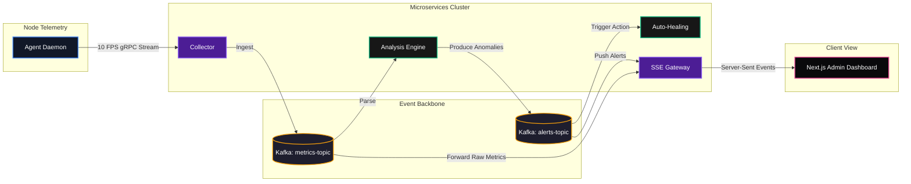
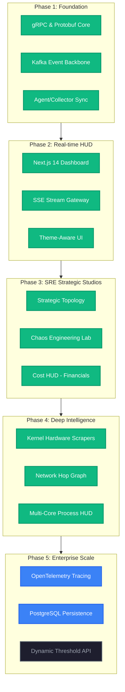

# SRE Nexus: Real-time Incident Monitoring & Auto-Healing Platform

A production-grade, event-driven microservices architecture built with **Go (1.22+)**, **gRPC**, **Protobuf**, **Apache Kafka**, and **Next.js 14**. This platform demonstrates high-fidelity observability and automated remediation patterns used in hyper-scale environments.

---

## 🏗 Architecture: The "Command & Control" Loop

SRE Nexus operates on a 10 FPS (frames-per-second) telemetry pulse, ensuring that from the moment a kernel-level anomaly occurs, it is visualized on the dashboard in less than 200ms.


```mermaid
graph LR
    classDef agent fill:#111827,stroke:#3b82f6,stroke-width:2px,color:#fff;
    classDef grpc fill:#4c1d95,stroke:#8b5cf6,stroke-width:2px,color:#fff;
    classDef kafka fill:#1e1e2e,stroke:#f59e0b,stroke-width:2px,color:#fff;
    classDef compute fill:#171717,stroke:#10b981,stroke-width:2px,color:#fff;
    classDef front fill:#09090b,stroke:#ec4899,stroke-width:2px,color:#fff;

    subgraph Node Telemetry
        A[Agent Daemon]:::agent
    end

    subgraph Microservices Cluster
        B[Collector]:::grpc
        D[Analysis Engine]:::compute
        H[Auto-Healing]:::compute
        G[SSE Gateway]:::grpc
    end

    subgraph Event Backbone
        C[(Kafka: metrics-topic)]:::kafka
        E[(Kafka: alerts-topic)]:::kafka
    end

    subgraph Client View
        F[Next.js Admin Dashboard]:::front
    end

    A -->|10 FPS gRPC Stream| B
    B -->|Ingest| C
    C -->|Parse| D
    C -->|Forward Raw Metrics| G
    D -->|Produce Anomalies| E
    E -->|Trigger Action| H
    E -->|Push Alerts| G
    G -->|Server-Sent Events| F
```

### Core Pipeline Details:
1.  **Agent Service**: Scrapes Linux Kernel paths (`/sys/class/hwmon`, `/proc/stat`) to collect raw hardware metrics. Uses **gRPC Client Streaming** for persistent, low-overhead data egress.
2.  **Collector Service**: A high-throughput gRPC receiver that unmarshals Protobufs at scale and publishes to Kafka.
3.  **Analysis Engine**: Performs sliding-window heuristics to detect anomalies (e.g., CPU thermal spikes, connection floods).
4.  **Auto-Healing Service**: Subscribes to critical alerts and executes isolation/restart scripts (Simulated Kubernetes API integration).
5.  **SSE Gateway**: Bridges the internal Kafka backbone to external web-clients via Server-Sent Events.

---

## 💎 Advanced Features (v2.6.0)

### 🛰 Strategic Topology (Service Mesh Studio)
A high-definition interactive map of service dependencies.
*   **Correlation Mesh**: Automatically maps inbound streams to downstream SQL/gRPC dependencies.
*   **Stability Index**: Real-time calculation of mesh health based on latency jitter and error rates.
*   **Particle Physics**: Visualizes directional data intensity through accelerated particle paths.

### 🧪 Chaos Lab (Fault Injection)
Mission-control grade interface for testing system resilience.
*   **Fault Injection**: Simulation of Service Termination, Latency Spikes (e.g., +2000ms), and Network Jitter.
*   **Analytical Diagnosis**: Generates deterministic insights/heuristics after an experiment to evaluate recovery performance.
*   **RBAC Protected**: Destructive actions are gated by the **Authentication Core**.

### 💰 Financial Observability (Cost HUD)
Integrates infrastructure load with operational expenditure.
*   **Resource Burn Projections**: Estimated monthly cloud expenditure (₹) based on actual power draw.
*   **1-Click Optimizer**: Provides actionable resizing recommendations to eliminate cloud waste.

### 📡 Internet Tracer (Network HUD)
Real-time network diagnostics beyond standard metrics.
*   **Visual Hop Graph**: A traceroute implementation mapping the path from host to target gateway.
*   **Throughput Analytics**: Monitoring sub-second Bit-per-second deltas for TX/RX streams.

### 🌡 Hardware & Processor Deep-Dive
*   **Cooling Array**: Real-time monitoring of CPU/GPU fan speeds (RPM) mapped directly from the Kernel.
*   **Energy Metrics**: Power consumption tracking (Watts) with 1m/1h/24h projections.
*   **The Processor HUD**: Live multi-core utilization charts and "Top Consumers" process list sorting.

---

## 🛠 Tech Stack

*   **Language**: Go (Clean Architecture)
*   **Messaging**: Apache Kafka (Distributed Event Bus)
*   **RPC**: gRPC with Protocol Buffers
*   **Frontend**: Next.js 14 (App Router), Tailwind CSS, Recharts
*   **UI/UX**: Glassmorphic HUD with Theme-Aware tokens (Dark/Light mode)
*   **Architecture**: Docker, Kubernetes (Ready-to-deploy manifests)

---

## 🚀 Getting Started

### 1. Requirements
*   Go 1.22+
*   Docker + Docker Compose
*   Node.js 18+

### 2. Infrastructure
Launch the backing Kafka, Zookeeper, and Database instances:
```bash
docker-compose up -d
```

### 3. Backend Services
Run the automated unified-start script:
```bash
./start_backend.sh
```
*Alternatively, run services manually in `services/agent`, `services/collector`, etc.*

### 4. Admin Dashboard
```bash
cd frontend
npm install
npm run dev
```
Explore the dashboard at `http://localhost:3000`. **Default Login: `admin` / `admin123`**

---

## 📑 Technical Reference
For deep implementation details on Protobuf schemas, MTTR calculations, and SSE propagation, see [**DOCUMENTATION.md**](./DOCUMENTATION.md).

---

## 🔮 Roadmap Progress (90%)


```mermaid
graph TD
    classDef completed fill:#10b981,stroke:#059669,stroke-width:2px,color:#fff;
    classDef inprogress fill:#3b82f6,stroke:#2563eb,stroke-width:2px,color:#fff;
    classDef planned fill:#1e1e2e,stroke:#4b5563,stroke-width:2px,color:#9ca3af;

    subgraph P1[Phase 1: Foundation]
        A[gRPC & Protobuf Core]:::completed
        B[Kafka Event Backbone]:::completed
        C[Agent/Collector Sync]:::completed
    end

    subgraph P2[Phase 2: Real-time HUD]
        D[Next.js 14 Dashboard]:::completed
        E[SSE Stream Gateway]:::completed
        F[Theme-Aware UI]:::completed
    end

    subgraph P3[Phase 3: SRE Strategic Studios]
        G[Strategic Topology]:::completed
        H[Chaos Engineering Lab]:::completed
        I[Cost HUD - Financials]:::completed
    end

    subgraph P4[Phase 4: Deep Intelligence]
        J[Kernel Hardware Scrapers]:::completed
        K[Network Hop Graph]:::completed
        L[Multi-Core Process HUD]:::completed
    end

    subgraph P5[Phase 5: Enterprise Scale]
        M[OpenTelemetry Tracing]:::inprogress
        N[PostgreSQL Persistence]:::inprogress
        O[Dynamic Threshold API]:::planned
    end

    P1 --> P2
    P2 --> P3
    P3 --> P4
    P4 --> P5
```


---

## 📝 Disclaimer
*This project was developed with AI-assisted engineering (Gemini/Antigravity) and refined for high-fidelity SRE practice and system performance optimization.*

